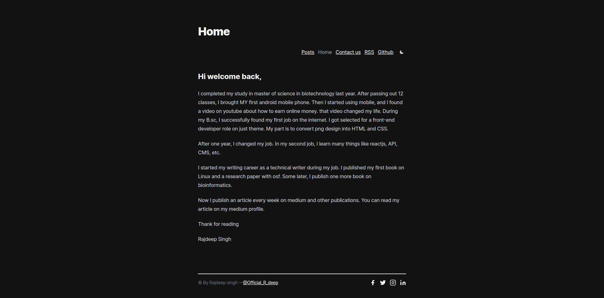
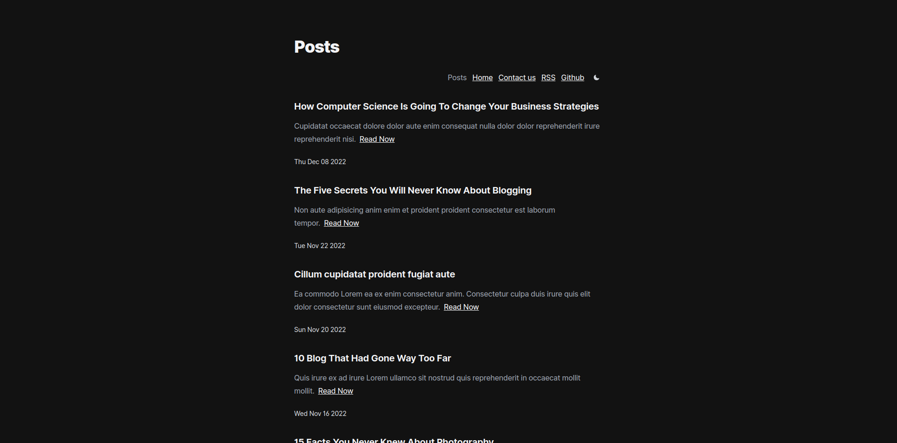
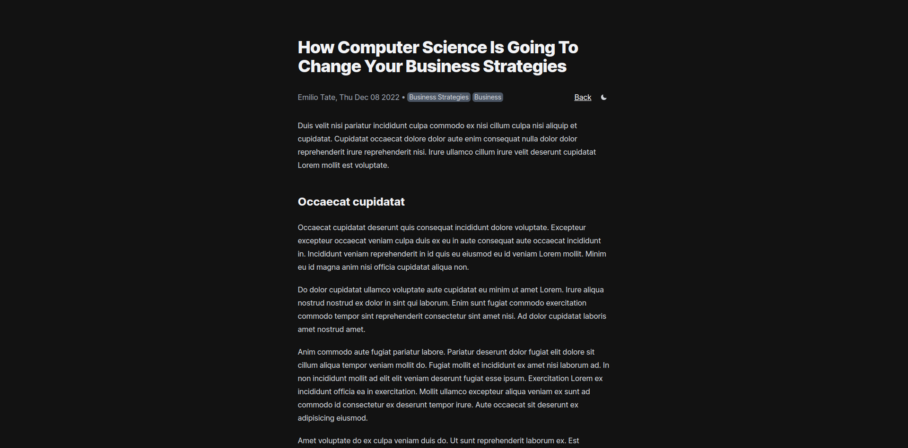

# Nextra Blog Theme

This portfolio BLOG is built with **Next.js** and [Nextra](https://nextra.vercel.app/). I used the nextra blog theme to built this blog.

## Feature

- Home page
- Author support
- Tags support
- Newsletter support
- Comment support
- Syntax ( code ) Highlighting
- Header,postFooter and footer customization
- SEO and Sitemap support.

### Home



### Posts page



### Reading Page



## Configuration

1. Update your footer, navbar, comments and postFooter in `theme.config.js`.
2. Update the meta tags in `pages/_document.js`.
3. Update the posts inside `pages/posts/*.md` with your own content.

### Note

> Remove the basePath `basePath: '/nextra-blog'` in `next.config.js`. Other wise you see a blank screen on `localhost:3000`.

## How to use

```bash

# Step 1
git clone https://github.com/frontendweb3/nextra-blog.git

# Step 2
cd nextra-blog

# Step 3
yarn install

# Step 4
yarn dev

# step 5
# remove the basePath in next.config.js
basePath: '/nextra-blog',

```
